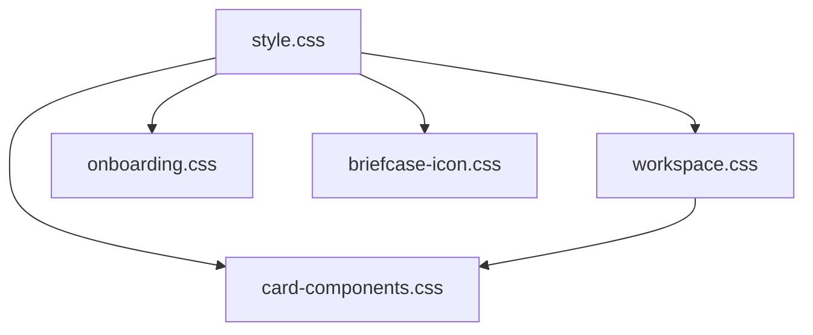

# CSS Documentation

## Overview

This comprehensive documentation covers the CSS architecture of the web application, providing detailed insights into file organization, dependencies, best practices, and maintenance guidelines. The styling system follows a modular approach with glassmorphic design principles and responsive behavior.

## 📋 Table of Contents

### Core Documentation
- **[CSS Architecture](css-architecture.md)** - Complete architectural overview and design patterns
- **[File Inventory](file-inventory.md)** - Detailed catalog of all CSS files and their responsibilities
- **[Dependency Mapping](dependency-map.md)** - Visual and textual dependency relationships
- **[Best Practices](best-practices.md)** - Guidelines, conventions, and troubleshooting
- **[Cleanup Guide](clean.md)** - Maintenance recommendations and obsolete code identification

### Quick Navigation
- [🏗️ Architecture Overview](#️-architecture-overview)
- [📁 File Structure](#-file-structure)
- [🔗 Dependencies](#-dependencies)
- [🎨 Design System](#-design-system)
- [📱 Responsive Design](#-responsive-design)
- [🚀 Getting Started](#-getting-started)
- [🔧 Maintenance & Updates](#-maintenance--updates)

---

## 🏗️ Architecture Overview

The CSS system is built on five core principles:

1. **Modular Organization** - Each file serves a specific purpose
2. **Component-Based Design** - Styles organized around UI components
3. **Glassmorphic Consistency** - Unified visual language throughout
4. **Performance Optimization** - GPU-accelerated animations and efficient selectors
5. **Responsive-First** - Mobile-first approach with progressive enhancement

> 📖 **Deep Dive:** [CSS Architecture Documentation](css-architecture.md)

---

## 📁 File Structure

```
client/css/
├── style.css              # Core styles, typography, glassmorphic tables
├── workspace.css          # Workspace canvas, cards, zoom controls
├── card-components.css    # File handling, modals, PDF preview
├── onboarding.css         # Agent selection and onboarding flow
└── briefcase-icon.css     # Custom icon implementations
```

### File Responsibilities

| File | Size | Primary Purpose | Key Features |
|------|------|-----------------|--------------|
| **[style.css](file-inventory.md#1-stylecss-3255-lines)** | 3,255 lines | Core styles & typography | Glassmorphic tables, CSS variables, chat interface |
| **[workspace.css](file-inventory.md#2-workspacecss-1365-lines)** | 1,365 lines | Workspace functionality | Canvas system, card management, zoom controls |
| **[card-components.css](file-inventory.md#3-card-componentscss-975-lines)** | 975 lines | Modular components | File handling, sync status, PDF viewer |
| **[onboarding.css](file-inventory.md#4-onboardingcss-592-lines)** | 592 lines | Onboarding flow | Agent selection, search interface |
| **[briefcase-icon.css](file-inventory.md#5-briefcase-iconcss-56-lines)** | 56 lines | Custom icons | FontAwesome overrides, SVG icons |

> 📖 **Complete Details:** [File Inventory Documentation](file-inventory.md)

---

## 🔗 Dependencies

### External Dependencies
- **Google Fonts** - Inter font family (all weights)
- **Font Awesome 6.4.0** - Icon system
- **Highlight.js** - Code syntax highlighting

### Internal Dependencies


> 📖 **Detailed Mapping:** [Dependency Documentation](dependency-map.md)

---

## 🎨 Design System

### CSS Custom Properties
The system uses a comprehensive variable system defined in `style.css`:

```css
:root {
  /* Color Palette */
  --colour-1: #ffffff;    /* Primary background */
  --colour-2: #f3f4e5;    /* Secondary background */
  --colour-3: #2f2f2e;    /* Primary text */
  --colour-4: #f9e479;    /* Accent yellow */
  
  /* Layout Variables */
  --section-gap: 25px;
  --border-radius-1: 8px;
  --font-1: "Inter";
}
```

### Glassmorphic Effects
Signature visual style with backdrop blur and transparency:

```css
.glassmorphic-element {
  background: rgba(255, 255, 255, 0.95);
  backdrop-filter: blur(25px);
  border: 1px solid rgba(255, 255, 255, 0.4);
  box-shadow: 0 8px 32px rgba(0, 0, 0, 0.08);
}
```

> 📖 **Design Patterns:** [CSS Architecture - Glassmorphic System](css-architecture.md#glassmorphic-effects)

---

## 📱 Responsive Design

### Breakpoint System
Mobile-first approach with consistent breakpoints:

- **Mobile:** `max-width: 480px`
- **Tablet:** `max-width: 990px`
- **Desktop:** `min-width: 991px`
- **Large Desktop:** `min-width: 1200px`

### Key Responsive Features
- Fluid grid systems with CSS Grid
- Scalable typography using `clamp()`
- Touch-optimized interactions
- Adaptive sidebar behavior

> 📖 **Responsive Guidelines:** [Best Practices - Responsive Design](best-practices.md#responsive-design-and-performance-guidelines)

---

## 🚀 Getting Started

### For New Developers

1. **Start Here:** Read the [CSS Architecture](css-architecture.md) overview
2. **Understand Files:** Review the [File Inventory](file-inventory.md)
3. **Learn Dependencies:** Study the [Dependency Map](dependency-map.md)
4. **Follow Guidelines:** Implement using [Best Practices](best-practices.md)

### For Maintenance

1. **Regular Cleanup:** Use the [Cleanup Guide](clean.md) for maintenance
2. **Performance:** Follow [optimization guidelines](best-practices.md#performance-optimization-guidelines)
3. **Consistency:** Maintain [naming conventions](best-practices.md#naming-conventions-and-class-structure-patterns)

### Quick Reference

| Task | Documentation |
|------|---------------|
| Adding new components | [Best Practices - Component Naming](best-practices.md#bem-inspired-methodology) |
| Modifying existing styles | [Dependency Map - Safe Modifications](dependency-map.md#safe-modification-practices) |
| Cleaning up CSS | [Cleanup Guide - Migration Strategy](clean.md#migration-strategy) |
| Troubleshooting issues | [Best Practices - Troubleshooting](best-practices.md#troubleshooting-guides) |
| Understanding file roles | [File Inventory - Responsibilities](file-inventory.md#file-structure) |

---

## 🔧 Maintenance & Updates

### Regular Tasks
- **Monthly:** Review [cleanup recommendations](clean.md#cleanup-recommendations-and-migration-paths)
- **Quarterly:** Validate [dependency mappings](dependency-map.md#dependency-validation-checklist)
- **As Needed:** Update [best practices](best-practices.md#maintenance-workflow)

### Contributing Guidelines
1. Follow established [naming conventions](best-practices.md#naming-conventions-and-class-structure-patterns)
2. Use existing [CSS custom properties](css-architecture.md#css-custom-properties-system)
3. Maintain [glassmorphic consistency](css-architecture.md#glassmorphic-effects)
4. Test across [responsive breakpoints](best-practices.md#established-breakpoints)

---

## 📚 Additional Resources

### External Links
- [CSS Grid Guide](https://css-tricks.com/snippets/css/complete-guide-grid/)
- [Flexbox Guide](https://css-tricks.com/snippets/css/a-guide-to-flexbox/)
- [CSS Custom Properties](https://developer.mozilla.org/en-US/docs/Web/CSS/Using_CSS_custom_properties)
- [Backdrop Filter Support](https://caniuse.com/css-backdrop-filter)

### Internal References
- [Project CSS Philosophy](css-architecture.md#architecture-philosophy)
- [Performance Optimizations](css-architecture.md#performance-optimizations)
- [Browser Compatibility](css-architecture.md#browser-compatibility)
- [Accessibility Considerations](css-architecture.md#accessibility-considerations)

---

## 📖 Complete Cross-Reference Index

### By Topic

#### **Architecture & Design**
- [CSS Architecture Overview](css-architecture.md) - Complete architectural documentation
- [Modular CSS Approach](css-architecture.md#modular-css-approach) - File organization principles
- [Glassmorphic Design System](css-architecture.md#glassmorphic-effects) - Visual design patterns
- [CSS Custom Properties System](css-architecture.md#css-custom-properties-system) - Variable system

#### **File Management**
- [File Inventory](file-inventory.md) - Complete file catalog
- [style.css Details](file-inventory.md#1-stylecss-3715-lines) - Core styles documentation
- [workspace.css Details](file-inventory.md#2-workspacecss-1624-lines) - Workspace functionality
- [Dependency Relationships](dependency-map.md#file-dependency-relationships) - File interdependencies

#### **Development Guidelines**
- [Best Practices](best-practices.md) - Complete development guidelines
- [Naming Conventions](best-practices.md#naming-conventions-and-class-structure-patterns) - Code standards
- [Performance Guidelines](best-practices.md#performance-optimization-guidelines) - Optimization techniques
- [Responsive Design](best-practices.md#responsive-design-and-performance-guidelines) - Mobile-first approach

#### **Maintenance & Cleanup**
- [Cleanup Guide](clean.md) - Maintenance strategies
- [Obsolete Code Identification](clean.md#obsolete-css-classes-and-modern-replacements) - Legacy code removal
- [Migration Strategies](clean.md#migration-strategy) - Safe update procedures
- [Performance Impact](clean.md#estimated-impact) - Optimization benefits

#### **Dependencies & Relationships**
- [Dependency Map](dependency-map.md) - Complete dependency documentation
- [Import Hierarchy](dependency-map.md#css-import-hierarchy) - File loading order
- [Critical Dependencies](dependency-map.md#critical-dependency-paths) - High-impact relationships
- [Safe Modifications](dependency-map.md#safe-modification-practices) - Change guidelines

### By File Type

#### **Core Files**
- [style.css](file-inventory.md#1-stylecss-3715-lines) | [Dependencies](dependency-map.md#core-dependencies-stylecss) | [Cleanup](clean.md#stylecss-highest-priority)
- [workspace.css](file-inventory.md#2-workspacecss-1624-lines) | [Dependencies](dependency-map.md#workspace-dependencies-workspacecss) | [Cleanup](clean.md#workspacecss-medium-priority)

#### **Component Files**
- [card-components.css](file-inventory.md#3-card-componentscss-1200-lines) | [Dependencies](dependency-map.md#card-components-dependencies-card-componentscss)
- [onboarding.css](file-inventory.md#4-onboardingcss-800-lines) | [Dependencies](dependency-map.md#onboarding-dependencies-onboardingcss)
- [briefcase-icon.css](file-inventory.md#5-briefcase-iconcss-80-lines) | [Dependencies](dependency-map.md#icon-system-dependencies-briefcase-iconcss)

---

*Last Updated: [Current Date] | Maintained by: Development Team*
