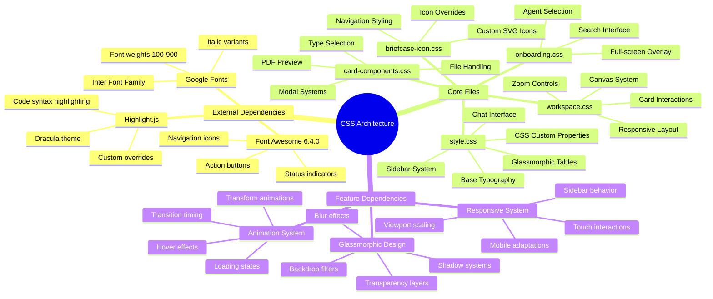
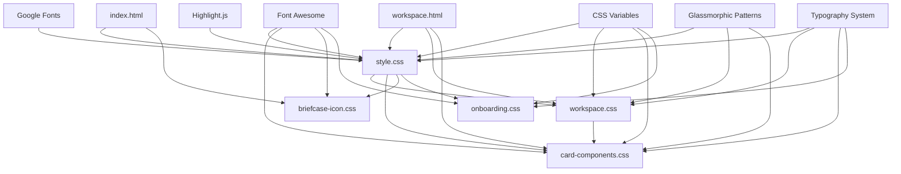

# CSS Dependency Mapping Documentation

**📍 Navigation:** [CSS Documentation](README.md) > Dependency Map

## Overview

This document provides a comprehensive mapping of CSS dependencies, import relationships, and component interdependencies within the web application's styling system. Understanding these relationships is crucial for making informed decisions when modifying styles and avoiding unintended cascade effects.

## 📋 Table of Contents
- [CSS Import Hierarchy](#css-import-hierarchy)
- [File Dependency Relationships](#file-dependency-relationships)
- [Component Interdependency Map](#component-interdependency-map)
- [Interactive Mindmap: CSS Architecture](#interactive-mindmap-css-architecture)
- [Dependency Flow Diagram](#dependency-flow-diagram)
- [Critical Dependency Paths](#critical-dependency-paths)
- [Performance Implications](#performance-implications)
- [Maintenance Guidelines](#maintenance-guidelines)
- [Browser Compatibility Considerations](#browser-compatibility-considerations)

## 🔗 Related Documentation
- **[File Inventory](file-inventory.md)** - Detailed breakdown of each CSS file
- **[CSS Architecture](css-architecture.md)** - Architectural patterns and design system
- **[Best Practices](best-practices.md)** - Safe modification practices and guidelines
- **[Cleanup Guide](clean.md)** - Dependency-aware cleanup recommendations

## CSS Import Hierarchy

### Primary Import Structure

The application follows a hierarchical CSS import structure based on page context:

```
HTML Pages
├── index.html
│   ├── /assets/css/style.css (core styles + Google Fonts import)
│   └── /assets/css/briefcase-icon.css (custom icon overrides)
├── workspace.html
│   ├── /assets/css/style.css (core styles + Google Fonts import)
│   ├── /assets/css/workspace.css (workspace-specific styles)
│   └── /assets/css/card-components.css (modular card components)
└── onboarding.html
    └── /assets/css/onboarding.css (standalone onboarding styles)
```

### External Dependencies

#### Google Fonts
- **Import Location**: `style.css` line 1
- **URL**: `https://fonts.googleapis.com/css2?family=Inter:ital,opsz,wght@0,14..32,100..900;1,14..32,100..900&display=swap`
- **Usage**: Primary font family (`--font-1: "Inter"`) used throughout the application
- **Fallbacks**: `-apple-system, BlinkMacSystemFont, 'Segoe UI', Roboto, sans-serif`

#### Font Awesome
- **Import Location**: HTML `<head>` sections
- **URL**: `https://cdnjs.cloudflare.com/ajax/libs/font-awesome/6.4.0/css/all.min.css`
- **Usage**: Icon system throughout the application
- **Dependencies**: Used in navigation, buttons, status indicators, and UI elements

#### Highlight.js
- **Import Location**: HTML `<head>` sections  
- **URL**: `//cdn.jsdelivr.net/gh/highlightjs/cdn-release@latest/build/styles/base16/dracula.min.css`
- **Usage**: Code syntax highlighting in chat messages and document content
- **Override**: Custom styles defined in `style.css` for glassmorphic code blocks

## File Dependency Relationships

### Core Dependencies (style.css)

**Dependencies:**
- Google Fonts (Inter family)
- CSS Custom Properties (@property declarations)

**Dependents:**
- All other CSS files inherit base variables and typography
- [briefcase-icon.css](file-inventory.md#5-briefcase-iconcss-80-lines) extends navigation styles
- [workspace.css](file-inventory.md#2-workspacecss-1624-lines) extends base glassmorphic patterns
- [card-components.css](file-inventory.md#3-card-componentscss-1200-lines) uses base color variables and typography

**Key Exports:**
```css
/* CSS Custom Properties */
:root {
  --colour-1: #ffffff;
  --colour-2: #f3f4e5;
  --colour-3: #2f2f2e;
  --colour-4: #f9e479;
  --yellow: #F9E479;
  --light-gray: #f7f7f7;
  --font-1: "Inter";
  --border-radius-1: 8px;
  /* ... additional variables */
}
```

### Workspace Dependencies (workspace.css)

**Dependencies:**
- [style.css](file-inventory.md#1-stylecss-3715-lines) (inherits all CSS custom properties)
- Font Awesome (for icons in controls and buttons)

**Key Features:**
- Workspace canvas with draggable functionality
- Zoom controls and glassmorphic effects
- Card positioning and interaction states
- Responsive sidebar integration

**Cascade Relationships:**
```css
/* Inherits from style.css */
.workspace-card {
  background: rgba(255, 255, 255, 0.95); /* Uses glassmorphic pattern */
  border-radius: var(--border-radius-1); /* Uses base variable */
  font-family: var(--font-1); /* Uses base typography */
}
```

### Card Components Dependencies (card-components.css)

**Dependencies:**
- [style.css](file-inventory.md#1-stylecss-3715-lines) (base variables and typography)
- [workspace.css](file-inventory.md#2-workspacecss-1624-lines) (card positioning and interaction patterns)
- Font Awesome (icons for file types and actions)

**Component Interdependencies:**
- File upload components depend on drag-drop styles from workspace.css
- Modal overlays extend glassmorphic patterns from style.css
- PDF preview components use base scrollbar styles

### Icon System Dependencies (briefcase-icon.css)

**Dependencies:**
- Font Awesome (overrides specific icon classes)
- Base navigation styles from style.css

**Override Pattern:**
```css
/* Replaces Font Awesome icons with custom SVG */
.fas.fa-folder::before {
  content: '' !important;
  background-image: url('data:image/svg+xml;base64,...');
  /* Overrides Font Awesome with custom briefcase icon */
}
```

### Onboarding Dependencies (onboarding.css)

**Dependencies:**
- style.css (base variables and typography)
- Font Awesome (icons for agent cards and navigation)

**Isolation Pattern:**
- Uses `!important` declarations to override base styles
- Implements full-screen overlay system
- Independent of workspace and card component styles

## Component Interdependency Map

### Glassmorphic System Dependencies

The application uses a consistent glassmorphic design system with the following dependency chain:

```
Base Glassmorphic Pattern (style.css)
├── Table Components
│   ├── Glassmorphic tables with blur effects
│   └── Hover animations and transformations
├── Card System (workspace.css)
│   ├── Workspace cards
│   ├── Floating menus
│   └── Modal overlays
└── Component Extensions (card-components.css)
    ├── File preview modals
    ├── Type selector overlays
    └── PDF viewer containers
```

### Typography Cascade

```
Inter Font Family (Google Fonts)
├── Base Typography (style.css)
│   ├── Headings (h1, h2, h3)
│   ├── Body text (p, li)
│   └── Code blocks (pre, code)
├── Workspace Typography (workspace.css)
│   ├── Card titles and descriptions
│   ├── Control labels and buttons
│   └── Status indicators
└── Component Typography (card-components.css)
    ├── File information displays
    ├── Modal content
    └── Form elements
```

### Color System Dependencies

```css
/* Primary Color Variables (style.css) */
--colour-1: #ffffff    /* Background base */
--colour-2: #f3f4e5    /* Secondary background */
--colour-3: #2f2f2e    /* Primary text */
--colour-4: #f9e479    /* Accent yellow */
--yellow: #F9E479      /* Alias for accent */

/* Usage Cascade */
├── Base UI (style.css): backgrounds, text, borders
├── Workspace (workspace.css): card backgrounds, controls
├── Cards (card-components.css): file types, status indicators
└── Icons (briefcase-icon.css): custom icon colors
```

## Interactive Mindmap: CSS Architecture



## Dependency Flow Diagram



## Critical Dependency Paths

### High-Impact Dependencies

1. **CSS Custom Properties (style.css)**
   - **Impact**: Changes affect all dependent files
   - **Risk Level**: High
   - **Dependents**: workspace.css, card-components.css, onboarding.css

2. **Glassmorphic Base Patterns (style.css)**
   - **Impact**: Visual consistency across components
   - **Risk Level**: Medium-High
   - **Dependents**: All card systems, modals, overlays

3. **Font Imports (Google Fonts)**
   - **Impact**: Typography rendering across entire application
   - **Risk Level**: Medium
   - **Fallback**: System fonts available

### Cascade Considerations

#### Specificity Hierarchy
```css
/* Specificity levels in order of precedence */
1. Inline styles (HTML style attribute)
2. IDs (#selector)
3. Classes (.selector), attributes, pseudo-classes
4. Elements (div, p, etc.)

/* Important declarations override normal cascade */
!important > normal specificity
```

#### Override Patterns
- **briefcase-icon.css**: Uses `!important` to override Font Awesome
- **onboarding.css**: Uses `!important` for full-screen isolation
- **workspace.css**: Extends base patterns without overrides
- **card-components.css**: Builds upon workspace patterns

## Performance Implications

### Loading Order Impact
1. **External fonts load first** (Google Fonts)
2. **Base styles establish foundation** (style.css)
3. **Feature-specific styles layer on top** (workspace.css, card-components.css)
4. **Override styles apply last** (briefcase-icon.css)

### Optimization Opportunities
- **Font loading**: Uses `display=swap` for faster text rendering
- **CSS custom properties**: Efficient for theme changes
- **Modular structure**: Allows selective loading based on page context

## Maintenance Guidelines

### Safe Modification Practices

1. **Modifying CSS Variables**
   - Test changes across all dependent files
   - Verify glassmorphic effects remain consistent
   - Check responsive behavior on all breakpoints

2. **Adding New Components**
   - Extend existing patterns rather than creating new ones
   - Use established CSS custom properties
   - Follow glassmorphic design system conventions

3. **Removing Styles**
   - Check for dependencies in other CSS files
   - Verify no JavaScript relies on specific class names
   - Test across all page contexts (index.html, workspace.html)

### Dependency Validation Checklist

- [ ] CSS custom properties are consistently used
- [ ] External font dependencies are available
- [ ] Icon dependencies (Font Awesome) are properly loaded
- [ ] Glassmorphic patterns maintain visual consistency
- [ ] Responsive breakpoints work across all components
- [ ] Override patterns don't conflict with base styles
- [ ] Animation timing is consistent across components

## Browser Compatibility Considerations

### Backdrop Filter Support
- **Modern browsers**: Full support for glassmorphic effects
- **Fallback**: Solid backgrounds with reduced transparency
- **Implementation**: `@supports` queries in style.css and workspace.css

### CSS Custom Properties
- **Support**: IE 11+ (with limitations)
- **Fallback**: Static values provided where critical
- **Usage**: Extensive throughout the system for theming

### Font Loading
- **Web fonts**: Progressive enhancement with system font fallbacks
- **Performance**: `font-display: swap` for faster rendering
- **Compatibility**: Universal support across browsers

This dependency mapping provides the foundation for understanding how CSS modifications will cascade through the system and helps ensure consistent styling across all components.

---

## 🔗 Related Documentation

- **[File Inventory](file-inventory.md)** - Complete catalog of CSS files and their specific roles
- **[CSS Architecture](css-architecture.md)** - Architectural overview and design patterns
- **[Best Practices](best-practices.md)** - Safe modification practices and guidelines
- **[Cleanup Guide](clean.md)** - Dependency-aware cleanup recommendations

**📍 Navigation:** [CSS Documentation](README.md) > Dependency Map
